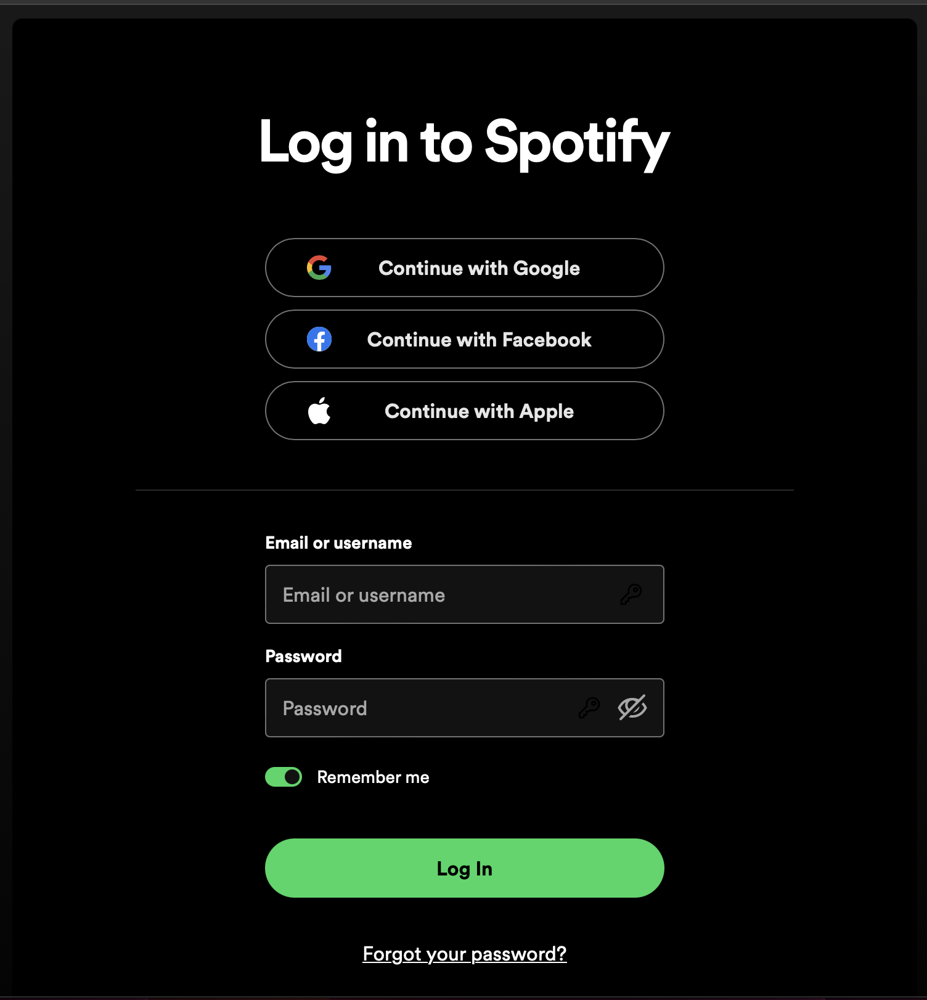
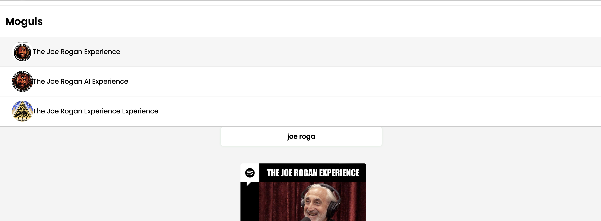
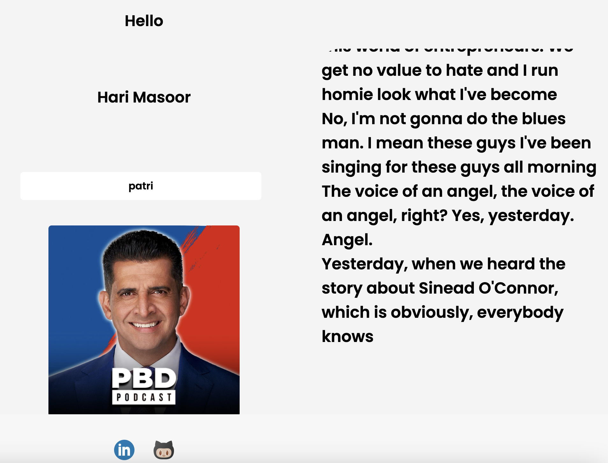
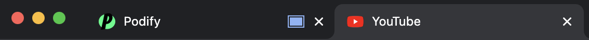

# Podify: Your Auditory Universe, Reimagined!

## **What's Podify?**
Ever wished you could pair your favorite tunes with real-time lyrics or that podcast with a live transcript? Meet Podify! It's not just a player; it's an experience. Dive into Spotify's immense library, enjoy your favorites, and witness the magic of words flowing on your screen in real-time.

## **Features You'll Love:**

- **Instant Spotify Connect**: Jump right in using your Spotify account.

<p align="center" style="padding-top: 50px; padding-bottom: 50px;"> 
    
</p>


- **Dynamic Search Bar**: Why wait? Get real-time suggestions from Spotify's treasure trove of content.

<p align="center" style="padding-top: 50px; padding-bottom: 50px;"> 
    
</p>

- **Listen & Watch**: Play content in our snazzy media player, and see words come alive on your screen.

<p align="center" style="padding-top: 50px; padding-bottom: 50px;"> 
    
</p>
- **Tab No-Stop Audio**: Switch tabs, mute, or even turn off your speakers. We've got you covered! Your transcription goes on, uninterrupted.

<p align="center" style="padding-top: 50px; padding-bottom: 50px;"> 
    
</p>

## **Under the Hood:**

Podify's awesomeness is powered by:

- **Chrome Magic**: Especially crafted for Chrome users. Capture crystal clear audio from any tab.
- **Whisper API**: Real-time transcription, because waiting is so last year.

## **Coding Glue:**
```javascript
async function fetchTranscription() {
    try {
        const response = await fetch('https://podify-backend.onrender.com/transcribe');
        const data = await response.json();

        // Display the data
        if (data.transcript) {
            displayTranscription(data);
        } else {
            // Handle errors or unexpected response format
            console.error('Failed to get transcription.');
        }
    } catch (error) {
        console.error('Error fetching transcription:', error);
    }
}


function displayTranscription(result) {
    const transcriptionBox = document.getElementById('transcriptionBox');
    if (result && result.transcript) {
        transcriptionBox.value = result.transcript;
    } else {
        transcriptionBox.value = "Failed to get transcription.";
    }
}

// Initialize on page load
document.addEventListener('DOMContentLoaded', () => {
    initializeAudioCapture();
});
```

---

**Jump In! Experience Podify & Elevate Your Listening Journey.** 🎧🚀📖
